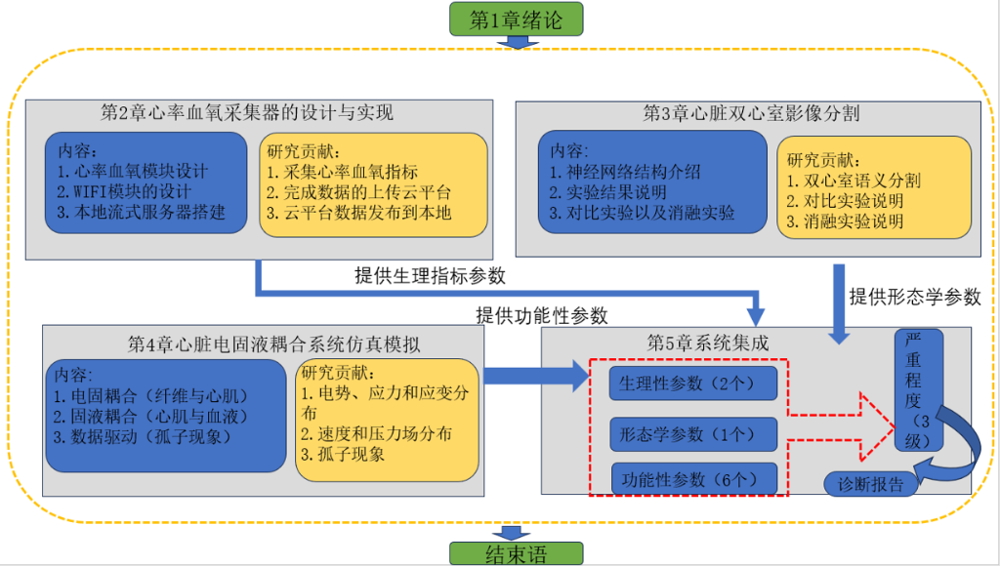

# Intelligent Diagnostic System for Biventricular Cardiomyopathy Based on Multimodal Data Fusion

## Abstract

In recent years, with the development of machine learning, deep learning, and medical imaging technology, significant progress has been made in the early detection and risk prediction of heart diseases. This paper presents an intelligent diagnostic system for biventricular cardiomyopathy based on multimodal data fusion, aiming to improve diagnostic efficiency and patient prognosis.

---

## 1. Introduction

The system integrates multiple technologies to achieve comprehensive cardiac diagnosis.

```
┌─────────────────────────────────────────────────────────────────┐
│                    Chapter 1: Introduction                      │
└───────────────────────────────┬─────────────────────────────────┘
                                ▼
┌─────────────────────────────────────────────────────────────────┐
│              System Architecture Overview                       │
├──────────────────────┬──────────────────────────────────────────┤
│   Data Acquisition   │   Image Segmentation   │   System Integration
└──────────────────────┴──────────────────────────────────────────┘
```

---

## 2. Design and Implementation of Heart Rate and Blood Oxygen Collector

### 2.1 System Design

This study designed a blood oxygen and heart rate collector with data acquisition, processing, and upload capabilities. The system focuses on low latency, low power consumption, and real-time interrupt response.

### 2.2 Hardware Implementation

- **Microcontroller**: STM32F103ZET6 development board
- **Sensor**: MAX30102 heart rate and blood oxygen detector
- **Display**: OLED screen for real-time physiological parameter display

### 2.3 Key Features

| Feature | Description |
|---------|-------------|
| Compact Size | Portable design for daily use |
| Non-invasive | Painless measurement |
| Easy Operation | User-friendly interface |
| Real-time Monitoring | Continuous health tracking |

### 2.4 Research Contributions

1. Collection of heart rate and blood oxygen indicators
2. Data upload to cloud platform
3. Data synchronization between cloud and local platforms

---

## 3. Biventricular Cardiac Image Segmentation

### 3.1 Neural Network Architecture

An improved semantic segmentation neural network combining the advantages of DeepLabV3 and UNet was developed for ventricular imaging segmentation.

### 3.2 Experimental Results

The model achieved high Dice and IOU values on the validation set, demonstrating superior performance compared to baseline models. The segmentation results serve as morphological evaluation indicators for cardiac analysis.

### 3.3 Research Contributions

1. Biventricular semantic segmentation
2. Comparative experimental validation
3. Ablation studies demonstrating effectiveness

---

## 4. Electromechanical-Fluid Coupling Simulation of Cardiac System

### 4.1 Simulation Framework

This chapter analyzes the time-varying characteristics of the heart through electromechanical-fluid coupling simulation:

1. **Electro-mechanical coupling**: Fiber and myocardial interactions
2. **Solid-fluid coupling**: Myocardial and blood interactions
3. **Data-driven approach**: Soliton phenomena

### 4.2 COMSOL Multiphysics Simulation

Finite element numerical simulation was performed using COMSOL Multiphysics software to model:
- Electrical signal propagation during cardiac contraction
- Myocardial cell response
- Mechanical response to electrical stimulation

### 4.3 Research Contributions

1. Electric potential, stress, and strain distribution analysis
2. Velocity and pressure field distribution mapping
3. Soliton phenomenon characterization

---

## 5. System Integration

### 5.1 System Architecture

The complete system integrates:

```
┌──────────────────────────────────────────────────────────────────┐
│                    Chapter 5: System Integration                  │
├──────────────────────────────────────────────────────────────────┤
│  Physiological Parameters (2)                                    │
│       ↓                                                          │
│  Morphological Parameters (1)                                    │
│       ↓                                                          │
│  Functional Parameters (6)                                       │
│       ↓                                                          │
│  ┌──────────────────────────────────────────────┐                │
│  │           Diagnosis Report (3 Levels)        │                │
│  │  • Severe    • Moderate    • Mild            │                │
│  └──────────────────────────────────────────────┘                │
└──────────────────────────────────────────────────────────────────┘
```

### 5.2 Core Components

| Component | Technology |
|-----------|------------|
| Frontend Interface | Tkinter |
| Database | SQLite |
| Image Processing | OpenCV, Transdeeplib-UNet |
| Medical Image Segmentation | Deep Learning |
| Diagnostic Model | XGBoost |

### 5.3 System Features

- Remote consultation functionality
- Automatic report generation
- Modular design for independent development and upgrade

---

## 6. Conclusion

This research demonstrates how modern technology can enhance medical service efficiency and quality through:

1. **Machine Learning & Feature Engineering**: Disease classification
2. **Transformer + UNet Architecture**: Improved medical image segmentation
3. **MCU System**: High-sensitivity data acquisition and processing
4. **Knowledge Graph**: Automated medication delivery

### System Flowchart



*Figure 1: System Architecture Flowchart showing the complete diagnostic workflow from data acquisition through image segmentation and simulation to final diagnosis report generation.*

### Future Directions

While the current system has limitations for enterprise-level deployment, it demonstrates promising directions for AI in medicine research, promoting personalized healthcare and interdisciplinary collaboration.

---

## Contact

For inquiries, please contact: [3257295075@qq.com](mailto:3257295075@qq.com)

---

## System Workflow Summary

```
Data Acquisition ──► Image Segmentation ──► Simulation Analysis ──► Diagnosis
       │                   │                     │                  │
       ▼                   ▼                     ▼                  ▼
  Physiological      Morphological       Functional          Report
   Parameters         Parameters         Parameters          Generation
```

--- 

*This document presents a comprehensive overview of an intelligent diagnostic system for biventricular cardiomyopathy, integrating multiple modalities for improved cardiac disease diagnosis.*