# Intelligent Diagnostic System for Biventricular Cardiomyopathy Based on Multimodal Data Fusion

<p align="center">
  
  
  
</p>

## Abstract

In recent years, with the development of machine learning, deep learning, and medical imaging technology, significant progress has been made in the early detection and risk prediction of heart diseases. This paper presents an intelligent diagnostic system for biventricular cardiomyopathy based on multimodal data fusion, aiming to improve diagnostic efficiency and patient prognosis.

---

## 1. Introduction

The system integrates multiple technologies to achieve comprehensive cardiac diagnosis.

```
┌─────────────────────────────────────────────────────────────────┐
│                    Chapter 1: Introduction                      │
└───────────────────────────────┬─────────────────────────────────┘
                                ▼
┌─────────────────────────────────────────────────────────────────┐
│              System Architecture Overview                       │
├──────────────────────┬──────────────────────────────────────────┤
│   Data Acquisition   │   Image Segmentation   │   System Integration
└──────────────────────┴──────────────────────────────────────────┘
```

---

## 2. Design and Implementation of Heart Rate and Blood Oxygen Collector

### 2.1 System Design

This study designed a blood oxygen and heart rate collector with data acquisition, processing, and upload capabilities. The system focuses on low latency, low power consumption, and real-time interrupt response.

### 2.2 Hardware Implementation

- **Microcontroller**: STM32F103ZET6 development board
- **Sensor**: MAX30102 heart rate and blood oxygen detector
- **Display**: OLED screen for real-time physiological parameter display

### 2.3 Software Interface and Cloud Control

#### 2.3.1 Mobile Application Interface

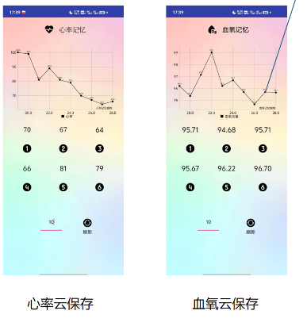

*Figure 1: Mobile application interface for heart rate and blood oxygen monitoring, providing intuitive data display and user interaction experience.*

#### 2.3.2 Cloud Control Platform

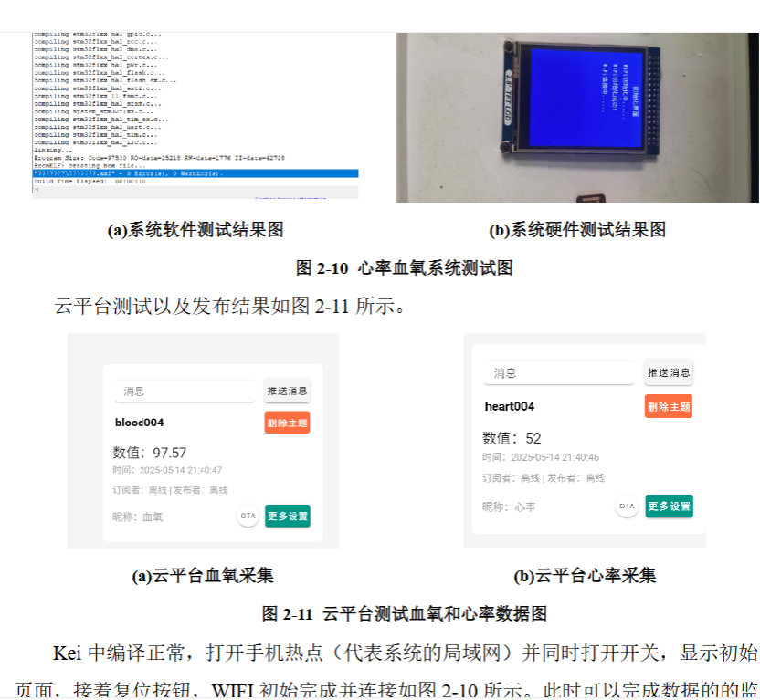

*Figure 2: Cloud control platform enables remote monitoring, data analysis, and system configuration management.*

### 2.4 Key Features

| Feature | Description |
|---------|-------------|
| Compact Size | Portable design for daily use |
| Non-invasive | Painless measurement |
| Easy Operation | User-friendly interface |
| Real-time Monitoring | Continuous health tracking |

### 2.5 Research Contributions

1. Collection of heart rate and blood oxygen indicators
2. Data upload to cloud platform
3. Data synchronization between cloud and local platforms

---

## 3. Biventricular Cardiac Image Segmentation

### 3.1 Dataset

This study utilizes the **ACDC (Automated Cardiac Diagnosis Challenge)** dataset, which is a publicly available cardiac MRI dataset widely used for cardiac image segmentation research. The dataset contains:

- **Training Set**: 100 patient cases with annotated end-diastolic and end-systolic frames
- **Testing Set**: 50 patient cases without annotations
- **Modalities**: Cine MRI images covering four-chamber, two-chamber, and short-axis views
- **Annotations**: Expert manual segmentations of left ventricle (LV), right ventricle (RV), and myocardium (MYO)

**Dataset Download**: [ACDC Challenge Dataset](https://www.creatis.insa-lyon.fr/Challenge/acdc/databases.html)

#### 3.1.1 Segmentation Results Visualization

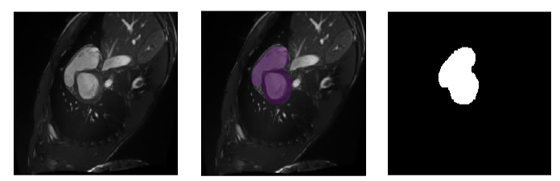

*Figure 3: Visualization of cardiac image segmentation results. The red region represents left ventricle (LV), blue region represents right ventricle (RV), and green region represents myocardium (MYO). The segmentation demonstrates precise delineation of cardiac structures for diagnostic analysis.*

### 3.2 Neural Network Architecture

#### 3.2.1 Segmentation Algorithm Overview

The proposed segmentation framework combines the strengths of multiple architectures:

- **DeepLabV3**: Utilizes atrous convolution to capture multi-scale contextual information, enabling precise boundary detection
- **UNet**: Employs encoder-decoder structure with skip connections to preserve spatial details during upsampling
- **Hybrid Approach**: Integrates contextual understanding from DeepLabV3 with detailed localization from UNet for superior segmentation accuracy

The network outputs three-class segmentation masks corresponding to left ventricle, right ventricle, and myocardium, enabling comprehensive cardiac morphological analysis.

### 3.3 Experimental Results

The model achieved high Dice and IOU values on the validation set, demonstrating superior performance compared to baseline models. The segmentation results serve as morphological evaluation indicators for cardiac analysis.

### 3.4 Research Contributions

1. Biventricular semantic segmentation
2. Comparative experimental validation
3. Ablation studies demonstrating effectiveness

---

## 4. Electromechanical-Fluid Coupling Simulation of Cardiac System

### 4.1 Simulation Framework

This chapter analyzes the time-varying characteristics of the heart through electromechanical-fluid coupling simulation:

1. **Electro-mechanical coupling**: Fiber and myocardial interactions
2. **Solid-fluid coupling**: Myocardial and blood interactions
3. **Data-driven approach**: Soliton phenomena

#### 4.1.1 Cardiac Geometric Modeling Process

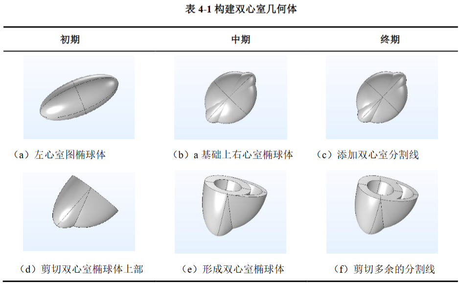

*Figure 5: Step-by-step process of cardiac geometric modeling from medical images to finite element mesh, enabling accurate biophysical simulation of cardiac dynamics.*

#### 4.1.2 Image Registration Technique

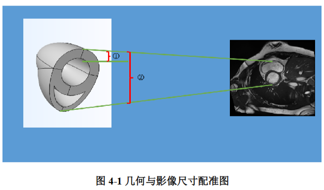

*Figure 6: Medical image registration process aligning multi-modal and multi-temporal cardiac images, ensuring spatial and temporal consistency for integrated analysis.*

#### 4.1.3 Gated Potential and Myocardial Deformation Distribution

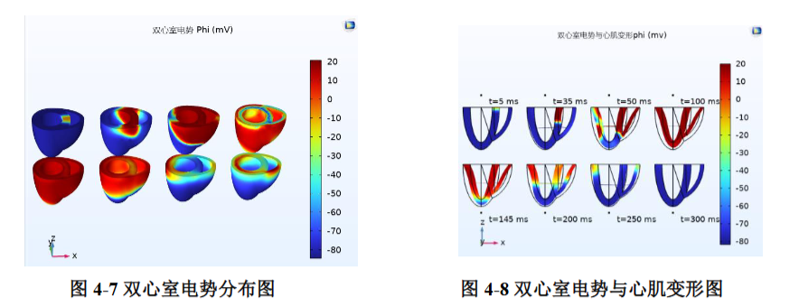

*Figure 7: Visualization of electrical potential distribution and corresponding myocardial deformation, illustrating the electromechanical coupling dynamics during cardiac cycle.*

### 4.2 COMSOL Multiphysics Simulation

Finite element numerical simulation was performed using COMSOL Multiphysics software to model:
- Electrical signal propagation during cardiac contraction
- Myocardial cell response
- Mechanical response to electrical stimulation

### 4.3 Research Contributions

1. Electric potential, stress, and strain distribution analysis
2. Velocity and pressure field distribution mapping
3. Soliton phenomenon characterization

#### 4.3.1 Large Language Model for Cardiac Diagnosis

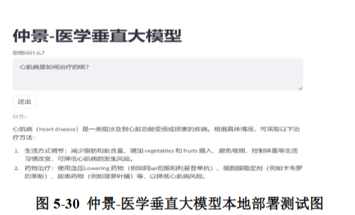

*Figure 8: Architecture of the pre-trained HuaToLLM model fine-tuned for cardiac disease diagnosis and medical consultation.*

**HuaTo LLM Overview and Fine-tuning Approach**

The system integrates a specialized large language model for intelligent cardiac disease diagnosis and consultation:

- **Base Model**: HuaTo LLM (华驼大语言模型), an open-source Chinese medical large language model
- **Model Download**: The HuaTo LLM can be obtained from [GitHub Repository](https://github.com/SCIR-HI/HuaTuo) or [Hugging Face Hub](https://huggingface.co/SCIR-HI)
- **Fine-tuning Dataset**: Curated QA dataset containing comprehensive cardiac disease questions and answers, including diagnostic criteria, treatment plans, and patient education
- **Fine-tuning Strategy**: Employed supervised fine-tuning (SFT) approach with LoRA (Low-Rank Adaptation) for parameter-efficient adaptation
- **Application Scenarios**: Automated medical report generation, intelligent question answering, diagnostic assistance, and treatment recommendation

The fine-tuned HuaToLLM provides natural language understanding and generation capabilities, enabling seamless integration with the diagnostic system for enhanced clinical decision support.

---

## 5. System Integration

### 5.1 System Architecture

The complete system integrates:

```
┌──────────────────────────────────────────────────────────────────┐
│                    Chapter 5: System Integration                  │
├──────────────────────────────────────────────────────────────────┤
│  Physiological Parameters (2)                                    │
│       ↓                                                          │
│  Morphological Parameters (1)                                    │
│       ↓                                                          │
│  Functional Parameters (6)                                       │
│       ↓                                                          │
│  ┌──────────────────────────────────────────────┐                │
│  │           Diagnosis Report (3 Levels)        │                │
│  │  • Severe    • Moderate    • Mild            │                │
│  └──────────────────────────────────────────────┘                │
└──────────────────────────────────────────────────────────────────┘
```

### 5.2 Core Components

| Component | Technology |
|-----------|------------|
| Frontend Interface | Tkinter |
| Database | SQLite |
| Image Processing | OpenCV, Transdeeplib-UNet |
| Medical Image Segmentation | Deep Learning |
| Diagnostic Model | XGBoost |

### 5.3 System Features

- Remote consultation functionality
- Automatic report generation
- Modular design for independent development and upgrade

---

## 6. Conclusion

This research demonstrates how modern technology can enhance medical service efficiency and quality through:

1. **Machine Learning & Feature Engineering**: Disease classification
2. **Transformer + UNet Architecture**: Improved medical image segmentation
3. **MCU System**: High-sensitivity data acquisition and processing
4. **Knowledge Graph**: Automated medication delivery

### System Flowchart


*Figure 4: System Architecture Flowchart showing the complete diagnostic workflow from data acquisition through image segmentation and simulation to final diagnosis report generation.*

### Future Directions

While the current system has limitations for enterprise-level deployment, it demonstrates promising directions for AI in medicine research, promoting personalized healthcare and interdisciplinary collaboration.

#### 6.2.1 Digital Twin for Cardiac Modeling

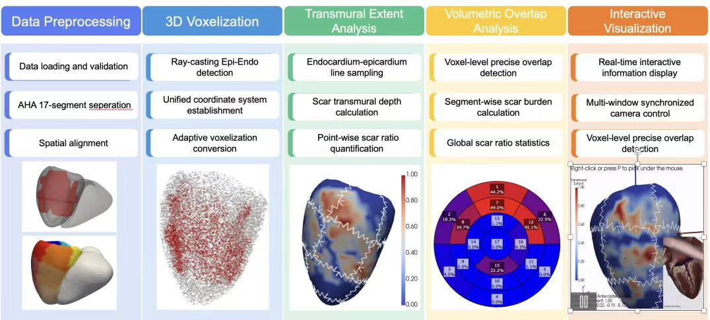

*Figure 9: Digital twin framework for cardiac modeling inspired by Zhipu AI Research Institute.*

**Acknowledgement**: We sincerely thank Zhipu AI Research Institute (智谱人工智能研究院) for providing valuable insights and methodologies on digital twin cardiac modeling. Their pioneering work has significantly influenced our research direction. For more information, please visit: [BAAI Hub](https://hub.baai.ac.cn/)

#### 6.2.2 Myocardial Scar Assessment and Cross-Modal Translation

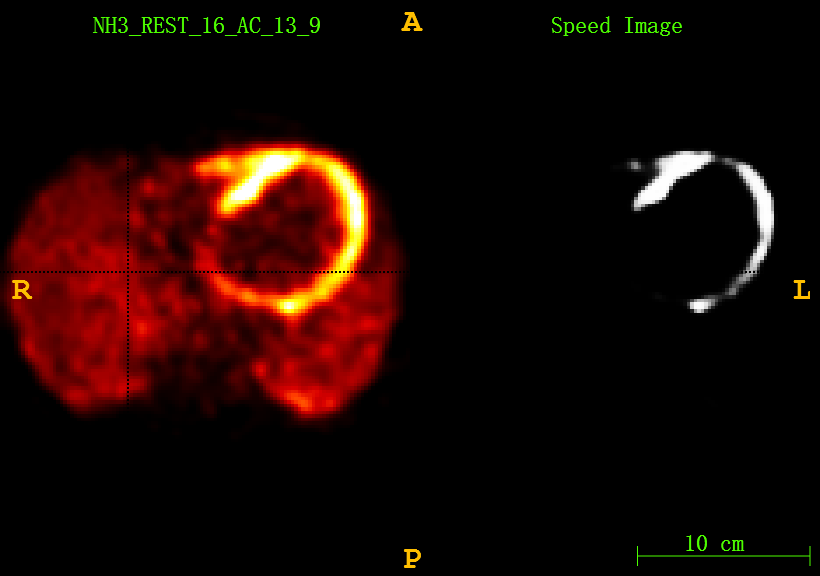

*Figure 10: Quantitative assessment of myocardial scar using PET imaging, demonstrating the potential for advanced cardiac diagnostic analysis.*

**Inspiration from Academic Conference**

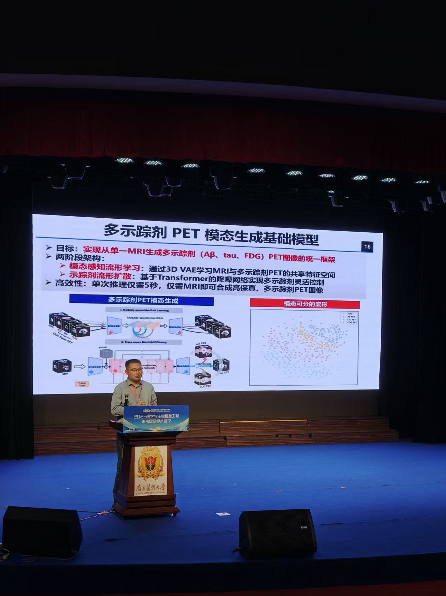

*Figure 11: Academic presentation at Southern Medical University 2025 Historical Academic Conference, introducing the innovative framework for cross-modal image synthesis.*

Our future research direction was inspired by this academic presentation, which introduced an innovative framework for generating PET data from single-modal MRI (Late Gadolinium Enhancement, LGE) images.

**Research Vision**

#### LGE-MRI Example

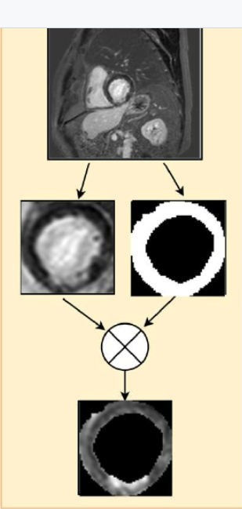

*Figure 12: Late Gadolinium Enhancement (LGE) MRI image, providing valuable structural information about myocardial fibrosis and scar tissue.*

#### LGE-PET Correlation

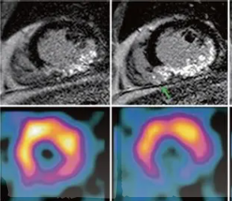

*Figure 13: Comparative analysis between LGE-MRI and corresponding PET data, demonstrating the multimodal relationships and complementary diagnostic information.*

**Research Framework**:
- **LGE-MRI Input**: Late Gadolinium Enhancement MRI provides valuable structural information about myocardial fibrosis
- **LGE-PET Correlation**: Comparative analysis between LGE-MRI and corresponding PET data enables understanding of multimodal relationships
- **Cross-Modal Translation Framework**: Developing deep learning models to generate realistic PET data from LGE-MRI alone
- **Clinical Impact**: Reducing patient radiation exposure while maintaining diagnostic accuracy through AI-powered modality synthesis

This approach aligns with the digital twin paradigm, enabling comprehensive cardiac assessment through integrated multi-modal analysis and virtual physiological modeling.

---

## Contact

For inquiries, please contact: [3257295075@qq.com](mailto:3257295075@qq.com)

---

## System Workflow Summary

```
Data Acquisition ──► Image Segmentation ──► Simulation Analysis ──► Diagnosis
       │                   │                     │                  │
       ▼                   ▼                     ▼                  ▼
  Physiological      Morphological       Functional          Report
   Parameters         Parameters         Parameters          Generation
```

---

*This document presents a comprehensive overview of an intelligent diagnostic system for biventricular cardiomyopathy, integrating multiple modalities for improved cardiac disease diagnosis.*
